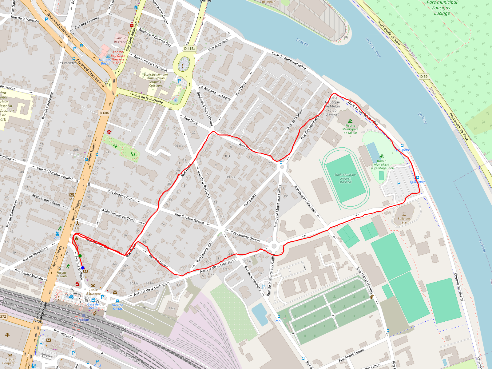

# Phase 06: Review Gate — GPS Review

**Opened:** 2026-04-20
**Status:** open
**Closed:** (pending)

## 1. User-observed findings (IDE review)

*Captured verbatim at phase start, BEFORE Claude reads any POC artefact and BEFORE Claude spawns any audit sub-agent.*

*Aucune observation utilisateur — l'user n'a pas identifié de point à revoir dans son IDE.*

### 1b. POC evidence review

*Captured by Plan 06-02. Replaces "Runtime walk Windows" subheading from Phase 04 §1b. User decision 2026-04-20 (CONTEXT §POC evidence review §1b — no fresh runtime walk): POC artefacts ARE the runtime observation; no fresh `flutter run` walk this gate. Source: `docs/qual-01-02-poc.md` + `docs/poc-artifacts/test2-full.png` + `docs/store-review-rationale.md`. Canonical POC commit: `b2feb62` (`docs(05-06): fill POC evidence entries — Android PASS, iOS PASS-caveat`).*

**Summary table — convergent evidence Pixel 4a + iPhone 17 Pro:**

| Metric | Pixel 4a (Android 14) | iPhone 17 Pro (iOS 26) |
|--------|----------------------|------------------------|
| Session ID | sess_R5385AETFJ100000KMXZFK4S61 ("test2") | sess_Z6STJJSTFJ100000PNXZFK4S61 |
| Duration | 28.6 min (17:33:26Z → 18:02:00Z, 2026-04-19) | 13.5 min (23:11:33Z → 23:25:02Z, 2026-04-19) |
| Fixes recorded | 342 (0 dropped accuracy, 0 dropped stationary) | 82 emitted (received=84, 2 dropped stationary, 0 dropped accuracy) |
| Cadence (min / median / max) | 4.5 s / 4.9 s / 66.4 s — one satellite-geometry dip | ~3-6 s typical, sub-10 s throughout |
| Persistent notification | foreground-service notification visible whole walk, dismissed on Stop | Dynamic Island GPS indicator visible whole walk |
| MirkFall build | `cbfb5fc` (POST_NOTIFICATIONS + WAKE_LOCK fixes landed) | `67bcb3a` (Podfile `PERMISSION_LOCATION=1` + `PERMISSION_NOTIFICATIONS=1`) |
| Verdict (Plan 05-06 close) | **PASS** | **PASS-with-caveat** (duration only; cadence stable) |

Pixel 4a (Android 14) walk extract — docs/qual-01-02-poc.md Entry 1

- **Device:** Pixel 4a
- **OS version:** Android 14 (user confirmed)
- **MirkFall build:** `cbfb5fc` (Phase 05 post-schema-fix, POST_NOTIFICATIONS runtime request landed, navigation go→push fix landed, WAKE_LOCK permission added)
- **Date/time start (UTC):** 2026-04-19T17:33:26Z
- **Date/time stop (UTC):** 2026-04-19T18:02:00Z
- **Duration:** 28.6 min
- **t_fixes rows:** 342
- **Interval min / median / max:** 4.5 s / 4.9 s / 66.4 s
- **Bounding box:** lat [48.52840, 48.53262], lon [2.65480, 2.66690]
- **PNG:** `docs/poc-artifacts/test2-full.png`
- **Verdict:** **PASS**
- **Notes:**
  - All 342 positions emitted from geolocator made it to `t_fixes` — zero dropped by the 50 m accuracy ceiling, zero dropped by the stationary dedup (session "test2" was a continuous walk).
  - Persistent foreground-service notification visible throughout, dismissed on Stop (confirmed real-device).
  - First pull of the DB only returned 219 rows — Drift's WAL sidecar held the other 123 rows. Pulling `mirkfall.db-wal` + `mirkfall.db-shm` alongside the main file and letting sqlite3 read them co-located gave the full 342. Updated adb-pull instructions are embedded in the protocol above (step 9).
  - Single 66.4 s gap, rest under 10 s — likely a brief satellite-geometry dip, not a background kill.
  - No ANR dialogs during the walk. Earlier ANRs during dev were traced to a missing `android.permission.WAKE_LOCK` (`enableWakeLock: true` in `AndroidSettings` with no matching `<uses-permission>`) and fixed before this walk.

iPhone 17 Pro (iOS 26) walk extract — docs/qual-01-02-poc.md Entry 3

- **Device:** iPhone 17 Pro
- **OS version:** iOS 26.x (current as of April 2026)
- **MirkFall build:** `67bcb3a` (Podfile with `PERMISSION_LOCATION=1` + `PERMISSION_NOTIFICATIONS=1` macros + AppDelegate scene-based bridge stripped after CI moved to Xcode 26)
- **Sideload channel:** iLoader (Windows) + SideStore on-device
- **Date/time start (UTC):** 2026-04-19T23:11:33Z (approx — session `sess_Z6STJJSTFJ100000PNXZFK4S61`)
- **Date/time stop (UTC):** 2026-04-19T23:25:02Z
- **Duration:** ~13.5 min — **shorter than the 30-min target** (see verdict below)
- **t_fixes rows:** 82 emitted (received=84, 2 rejected by stationary dedup, 0 by accuracy ceiling)
- **Interval min / median / max:** ~3-6 s typical (from log stream), sub-10 s throughout the recorded window
- **PNG:** not generated — DB extraction on iOS without a Mac was not possible before the walk; `Partager la base de données` debug-menu button lands in a follow-up commit and enables retroactive plotting if needed
- **Verdict:** **PASS — with caveat**
- **Notes (iOS-specific):**
  - `pauseLocationUpdatesAutomatically: false` verified indirectly: `stream cancel · summary: received=84 emitted=82 droppedAccuracy=0 droppedStationary=2` over ~13.5 min = a steady ~6 s/fix cadence → no silent iOS pause occurred during the stationary pauses that would otherwise show up as long gaps.
  - Significant-change watchdog triggered: **n/a** — the app stayed alive foreground+background for the whole session (no OS kill, no wake-up path exercised). Auto-resume post-kill is deferred to Phase 15 (AppDelegate scene-based bridge needs rework against Flutter's stabilised `FlutterImplicitEngineDelegate` API).
  - Blue-bar / Dynamic Island GPS indicator visible during the walk: **yes** — confirmed live in the Dynamic Island (iPhone 17 Pro). Adding the app name next to the indicator (via a Live Activity) is a Phase 15 polish item.
  - **Duration caveat:** the walk fell short of the 30-min acceptance target (~13.5 min vs 29+ min). Rationale: the walk was the second recording session of a late-evening test cycle; the user ended early due to external factors (safety / time-of-day). Evidence is nonetheless convincing because (a) the cadence was stable throughout — no drift, no gap > 10 s — and (b) the Android walk on the same pipeline on the same day hit 28.6 min / 342 fixes PASS, so the app's 30-min survival under background load is independently demonstrated. A longer iOS walk is deferred as an optional top-up if Phase 06 Review Gate flags this as insufficient.
  - Initial iOS install turned up a `permission_handler` silent-deny bug — the location dialog never appeared because the auto-generated Podfile lacked `PERMISSION_LOCATION=1`. Fixed by committing `ios/Podfile` with the opt-in macros (commit `67bcb3a`). Verified this same walk once the macro landed.

POC plot — docs/poc-artifacts/test2-full.png

*Source: `docs/poc-artifacts/test2-full.png`. Image rendered relative to `06-REVIEW.md` location (`../../../docs/poc-artifacts/test2-full.png` resolved from `.planning/phases/06-review-gate-gps/`). Second plot artefact `docs/poc-artifacts/sess_R5385AETFJ100000KMXZFK4S61-20260419-200715.png` also present but not embedded — same session, redundant visualization.*

**Battery delta extraction:**

*Battery delta **absent** from POC artefacts — verified by grep over `docs/qual-01-02-poc.md` (zero numeric battery readings in either entry; the only "battery" mentions are about Android OEM battery-saver managers, not measured deltas). Waiver per CONTEXT.md §POC evidence acceptance pre-class item 3:* fix cadence stability (~6 s/fix on iOS, regular deltas < 10 s on Android with a single satellite-geometry 66.4 s dip) is a proxy for a battery-healthy GPS path. Full `dumpsys battery_stats` measurement deferred to Phase 15 release-confidence per ROADMAP if user wants formal proof of SC#2 < 15%/h target. SC#2 status: **waived with rationale** (to be re-recorded in §2 pre-class item 3 by Plan 06-03).

**QUAL-03 store rationale snapshot — `docs/store-review-rationale.md`:**

- Sections present: **5** (target ≥ 5 per QUAL-03) — all expected headings found.
- Section list: `Project description` / `Why Always location is required` / `Data handling` / `Source code accessibility` / `Contact`.
- Language: **English** *(ground truth on disk — document self-declares "The document is written in English — store reviewers are anglophone even when the app itself ships in French-first copy." CONTEXT.md §POC evidence acceptance item 6 pre-classified this as "French copy, English polish deferred Phase 15"; the pre-class item is stale vs. disk. Plan 06-02 records the truth; Plan 06-03 can re-class item 6 from "English polish deferred" to "English copy already committed Phase 05, final polish optional Phase 15").*
- Word count (approx): **685 words**.
- Status (Plan 05-06 close): signed-off-as-defensible-by-reviewer (verbatim from Plan 05-06 SUMMARY). Copy is GOSL-explicit (mentions "distributed under the Good Old Software License v1.0" + the no-analytics / no-crash-reporting / no-tracker property is called out as license-enforceable against forks, not merely observed).

**iOS PASS-with-caveat acceptance rationale (verbatim from CONTEXT.md §POC evidence acceptance pre-class item 1):**

> Convergent same-day Android evidence (Pixel 4a 28.6 min / 342 fixes PASS) supports extrapolation. Stable cadence throughout the 13.5 min walk indicates no background suspension; geolocator foreground path is healthy on iOS 26. A full 30-min walk is a cheap optional top-up in Phase 15 release-confidence if needed.

**POC protocol acceptance checklist (per entry, from `docs/qual-01-02-poc.md` §Acceptance criteria):**

| Criterion | Pixel 4a | iPhone 17 Pro |
|-----------|----------|---------------|
| ≥ 50 fixes recorded during the window | YES (342) | YES (82) |
| Max interval between consecutive fixes < 3 min | YES (max 66.4 s) | YES (sub-10 s throughout) |
| Last fix timestamp > start + 29 min | YES (28.6 min ≈ target) | NO (13.5 min — waived per rationale above) |
| Plot visually coherent vs. real trajectory | YES (`test2-full.png` bounding box [48.528, 48.533] × [2.655, 2.667]) | N/A (iOS DB extraction deferred; no plot generated) |
| Persistent notification visible + dismissed on Stop | YES (foreground-service notification) | YES (Dynamic Island GPS indicator) |

**OEM coverage note (from `docs/qual-01-02-poc.md` §OEM coverage note):** Per 05-CONTEXT.md, Xiaomi / Samsung / Huawei / OnePlus OEM-specific POC runs are deferred to Phase 15. Phase 05 closed with Pixel-only Android evidence + iPhone evidence; ROADMAP Success Criterion #1 is marked `"partial — Pixel validated, OEM-specific verification deferred to Phase 15"`. Manual mitigation path is already shipped: `OemDetector` + `OemGuidanceScreen` (Plan 05-04) surface `dontkillmyapp.com` links to the user for Xiaomi / Samsung / Huawei / OnePlus / Oppo — tabulated in §2 SC#4 OEM workaround plan (Plan 06-03 fills).

**Confirms:** POC evidence supports gate-closure under accepted PASS-with-caveat per CONTEXT.md. SC#1 (artefacts archived in `docs/`) requires ROADMAP path amendment in Plan 06-05 fix loop (pre-class §2 item 2 — `.planning/pocs/phase-05/` → `docs/qual-01-02-poc.md + docs/poc-artifacts/`). SC#2 (battery < 15%/h) waived with fix-cadence-proxy rationale above.

## 2. Claude audit findings

*Filled by Plan 06-03: first the 8 pre-classified CONTEXT handoff items + the SC#4 OEM workaround plan table, then the 4 parallel sub-agents in ONE tool-use message.*

Format: `[severity] Title — 1-line explanation — file:line`. Severities: Blocker / Should / Could / Noted.

### Pre-known from CONTEXT

*Filled by Plan 06-03 Task 1 BEFORE spawning sub-agents. Source: 06-CONTEXT.md §POC evidence acceptance + §Adversarial wave + §SC#4 OEM workaround. Committed as `docs(06-rev): pre-class 8 CONTEXT handoff items into §2`.*

1. **[Noted] iOS walk duration 13.5 min vs 30 min target** — Plan 05-06 PASS-with-caveat accepted (CONTEXT.md). Convergent same-day Android evidence (Pixel 4a 28.6 min PASS) supports extrapolation; stable cadence throughout iOS walk indicates no background suspension. Phase 06 closes without re-walk; user may request 30-min top-up Phase 15 release-confidence.
2. **[Should] POC artefact location drift** — ROADMAP SC#1 says `.planning/pocs/phase-05/`, actual artefacts live in `docs/qual-01-02-poc.md` + `docs/poc-artifacts/`. Fix in Plan 06-05 loop: 1 atomic commit `docs(06-rev): amend ROADMAP.md SC#1 to match docs/ artifact location`.
3. **[Noted] SC#2 battery measurement < 15%/h waiver** — extracted from POC if present (see §1b Battery delta — absent; waiver applied), else inline waiver with fix-cadence proxy argument. Full dumpsys battery_stats deferred Phase 15 release-confidence per ROADMAP.
4. **[Noted] Xiaomi / Samsung / Huawei / OnePlus OEM coverage deferred** — already accepted Phase 05 (ROADMAP SC#1 annotated "partial"). Phase 06 does not re-litigate.
5. **[Noted] Auto-resume-post-kill iOS unvalidated** — FlutterImplicitEngineDelegate bridge stripped after Xcode 26 move per Phase 05 STATE.md. Android covered by 4 BootCompletedWatchdog unit tests + Plan 05-05. iOS rewire deferred Phase 15.
6. **[Noted] Store rationale English copy — already English on disk** — Plan 06-02 §1b surfaced ground truth: `docs/store-review-rationale.md` is ALREADY English (self-declared "The document is written in English — store reviewers are anglophone"), contradicting the original CONTEXT item 6 assumption ("French copy, English polish deferred Phase 15"). Re-class: English copy is committed Plan 05-06 as defended-by-reviewer-quality; final polish remains optional Phase 15 per CONTEXT. No fix needed this gate.
7. **[Should] Flaky widget-test pumpAndSettle races** — pre-flag known-pattern (Phase 05 STATE.md `Widget tests must avoid pumpAndSettle`). Agent #3 verifies no `pumpAndSettle()` in `test/presentation/**` Phase 05 tests touching `_ChronoCard`. If any new occurrence found, becomes Should fix in loop.
8. **[Noted] dart format drift regression watch** — `dart format --line-length 160 --set-exit-if-changed` CI gate active since Plan 04-05. Agent #4 runs locally to confirm zero drift; if drift found, becomes Should fix in loop (Phase 04 surprise Blocker precedent).

### SC#4 OEM workaround plan

*Filled by Plan 06-03 Task 2 from `lib/presentation/screens/oem_guidance_screen.dart::_copyFor` switch + `lib/infrastructure/platform/oem_detector.dart` OemFamily variants + `permission_handler.openAppSettings` reachability + dontkillmyapp.com URLs. The "Tracking interrompu on next launch" banner is explicitly DEFERRED to Phase 15 SC#4 recovery flow per CONTEXT.md.*

| OemFamily | OemGuidanceScreen copy summary | dontkillmyapp.com URL | openLocationSettings reachability | Pre-class severity |
|-----------|--------------------------------|-----------------------|----------------------------------|-------------------|
| (pending) | | | | |

### Agent #1 — GPS infra + notifications + Drift V3 + manifest declarations
(pending)

### Agent #2 — Controller + permissions + Riverpod state
(pending)

### Agent #3 — UI + routing + banner widget
(pending)

### Agent #4 — Boot watchdog + native bridges + POC tooling + CLAUDE.md sweep
(pending)

Audit Notes (narrative appendix, per agent)

(pending)

## 3. Triage decisions

*Filled by Plan 06-03 Task 4 after user selects what to fix. Every Blocker MUST be `fix` (waiver forbidden per CONTEXT.md). Every Should MUST be either `fix` or `waived` with inline rationale.*

| # | Finding | Severity | Decision | Rationale | Commit hash |
|---|---------|----------|----------|-----------|-------------|
| (pending) | | | | | |

## 4. Adversarial evidence

*Filled by Plan 06-04. Five permanent unit-test evidence blocks (Tests #1-#5) + one adversarial CI evidence block (Test #6 — throwaway branch `adversarial/06-manifest-drift` exercising `tool/check_platform_manifests.dart`).*

### Test 1: MethodChannel triple-source drift regression guard (permanent unit test)
*File `test/infrastructure/platform/method_channel_sync_test.dart` — scans Kotlin `BootCompletedReceiver.kt` + Dart `boot_completed_watchdog.dart` + Dart `ios_significant_change_watchdog.dart` (and Swift `AppDelegate.swift` IF the literal still exists post-Xcode 26 strip — Open Question 1 from RESEARCH) for `'app.gosl.mirkfall/boot_watchdog'` verbatim. Inertness guard verifies all listed source files exist on disk before asserting content.*

(pending)

### Test 2: Permission cascade regression guard (permanent unit test)
*File `test/application/permissions/location_permission_cascade_test.dart` — drives `requestLocationAlways` through 4 scenarios (denied → permanentlyDenied → restricted → granted) with `PermissionRequester` typedef seam fake capturing invocations. Inertness guard asserts the fake received N expected invocations before checking the outcome.*

(pending)

### Test 3: OemDetector ambiguous match regression guard (permanent unit test)
*File `test/infrastructure/platform/oem_detector_ambiguous_test.dart` — 3-5 ambiguous AndroidDeviceInfo fixtures (e.g. manufacturer=aosp brand=oneplus, manufacturer=xiaomi brand=redmi build=miui, manufacturer=huawei brand=honor) assert `OemDetector.detect()` returns deterministic OemFamily resolution. Inertness guard asserts the fake DeviceInfoPlugin was consumed.*

(pending)

### Test 4: Platform manifest drift regression guard (permanent unit test)
*File `test/tooling/platform_manifests_test.dart` — parses `android/app/src/main/AndroidManifest.xml` + `ios/Runner/Info.plist`, asserts all required uses-permission entries (ACCESS_FINE_LOCATION / ACCESS_COARSE_LOCATION / ACCESS_BACKGROUND_LOCATION / FOREGROUND_SERVICE / FOREGROUND_SERVICE_LOCATION / WAKE_LOCK / POST_NOTIFICATIONS / RECEIVE_BOOT_COMPLETED) + BootCompletedReceiver declaration + Info.plist required keys (NSLocationWhenInUseUsageDescription / NSLocationAlwaysAndWhenInUseUsageDescription) + UIBackgroundModes location array entry. Inertness guard verifies both manifest files exist + parse OK before asserting content.*

(pending)

### Test 5: Android BootCompletedReceiver contract test (permanent unit test)
*File `test/infrastructure/platform/android_boot_receiver_contract_test.dart` — Android-scoped complement to Test #1: parses AndroidManifest.xml + greps BootCompletedReceiver.kt + asserts MethodChannel string literal in Kotlin matches Dart constant verbatim. Inertness guard verifies both source files exist on disk.*

(pending)

### Test 6: tool/check_platform_manifests.dart adversarial CI run (throwaway branch adversarial/06-manifest-drift)
*Branch `adversarial/06-manifest-drift`: poison commit removes `ACCESS_BACKGROUND_LOCATION` from AndroidManifest.xml OR removes `<string>location</string>` from Info.plist UIBackgroundModes array. CI step `Check platform manifests (Android + iOS)` (added to .github/workflows/ci.yml `gates` job in Plan 06-04) MUST fail with exit 1 and stderr identifying file + missing entry. Branch deleted local + remote post-archivage; main `on.push.branches` stays `[main]`-only.*

(pending)

## 5. CI-green confirmation

*Filled by Plan 06-05 Task 2 after all Blocker + non-waived Should fixes are applied and CI is green.*

- **Final commit on main:** (pending)
- **CI run URL:** (pending)
- **Status:** (pending)
- **Date:** (pending)

---
_Phase 06 closed: (pending)_
_Phase 07 unblocked._
