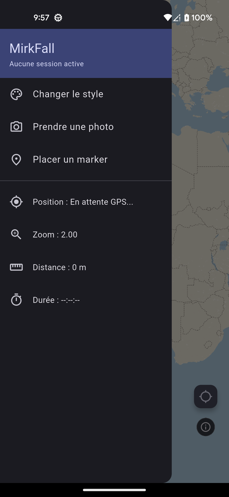
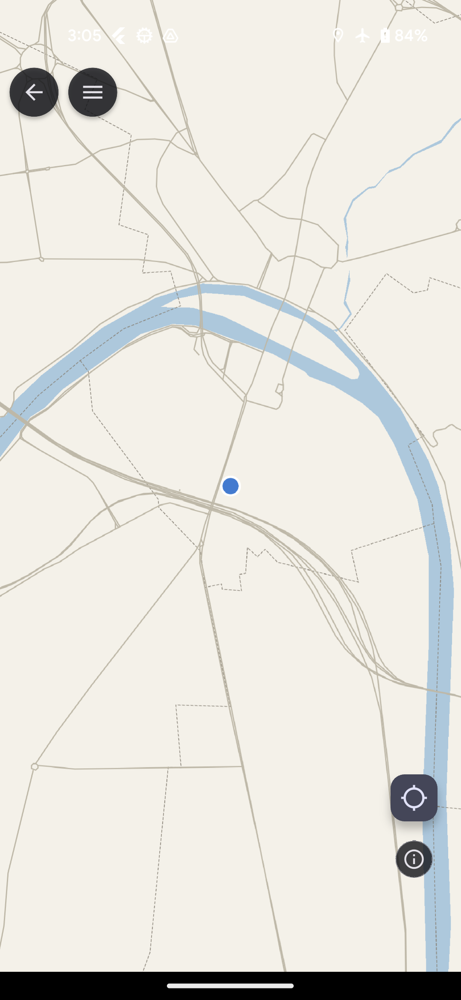
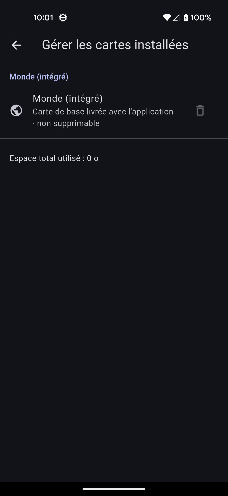
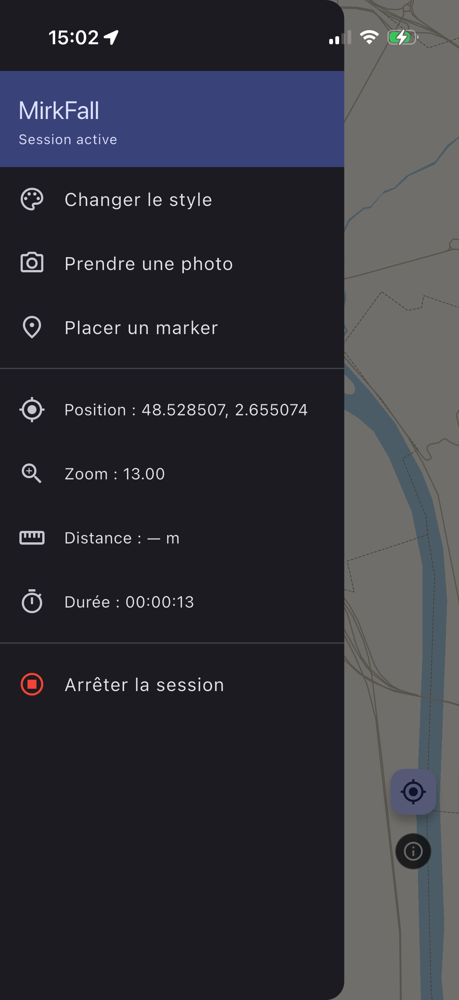

# Phase 08.1: Re-Review — Post-Walk Audit Review

**Opened:** 2026-04-24
**Status:** open
**Closed:** (pending)

## 1. User-observed findings (IDE review)

*Captured verbatim at phase start, BEFORE Claude reads walk artifacts and BEFORE Claude spawns any audit sub-agent.*

*Aucune observation utilisateur — l'user n'a pas identifié de point à revoir dans son IDE sur le delta Phase 08.*

### 1b. Device walk evidence (Phase 08.1 re-review runtime baseline)

*Filled by Plan 08.1-02 **with user-approved deviation from the original plan**: Phase 08.1 is a code-review phase (not a feature phase); per `CLAUDE.md §Code Review Phases`, review phases introduce no new runtime behavior, so capturing a dedicated `docs/phase-08.1-walk.md` + `docs/phase-08.1-walk-screenshots/` would not produce new evidence relative to the Phase 07 walk artifacts already on main. Decision 2026-04-24: §1b reuses the Phase 07 walks (Android Pixel 4a 2026-04-21 + iOS iPhone 17 Pro 2026-04-22/23 post-fix) as the runtime baseline for the Phase 08 delta re-review — identical to the approach Phase 08 itself took in its own §1b. The user ran informal retests during the Phase 08 49-fix loop (fix-forward validation), but captured no artifacts because no new runtime behavior was introduced. Next fresh walk lands naturally in Phase 09 (new feature). Per-device collapsed `<details>` sections (Phase 06 + Phase 08 precedent).*

<details>
<summary>Android Pixel 4a — PASS 2026-04-21 (Phase 07 walk reused as Phase 08.1 runtime baseline)</summary>

**Device:** Pixel 4a
**OS version:** Android 13 (4.14.302)
**MirkFall build:** `fbcbde6a2569baad84b3104eceed51b437e38ed4` (Phase 07 final smoke SHA — same codebase validated at Phase 08 §1b; Phase 08 delta `254b5d2 → ae6a4b6` is code-review refactors, no runtime behavior change)
**APK source:** https://github.com/ThongvanAlexis/GOSL-MirkFall/actions/runs/24834805699/artifacts/6601556400
**Date of walk (UTC):** 20260423 14h40 (Phase 07 final smoke)
**Walk duration:** 2 minutes
**Status:** PASS
**Source:** `docs/phase-07-smoke.md` — Entry 1 (Android), reused per user-approved deviation (Phase 08.1 is review phase; no new feature → no new walk)

**Screenshots (inline):**







**Cadence / observations table (extracted verbatim from `docs/phase-07-smoke.md` Entry 1 Step-by-step results):**

| #   | Step                                                | Result | Notes |
| --- | --------------------------------------------------- | ------ | ----- |
| 1   | Install + first launch                              | _PASS_ |       |
| 2   | "Préparation de la carte…" then SessionListScreen   | _PASS_ |       |
| 3   | Create + start session                              | _PASS_ |       |
| 4   | MapScreen: map renders + AppBar affordances visible | _PASS_ |       |
| 5   | Burger menu: 3 tiles + 3 live-data rows             | _PASS_ |       |
| 6   | Airplane mode cold-start: map still renders         | _PASS_ |       |
| 7   | Aruba download completes                            | _PASS_ |       |
| 8   | Aruba in Manage screen with correct size + version  | _PASS_ |       |
| 9   | Delete Aruba → disappears + world row stays         | _PASS_ |       |

**Airplane-mode evidence (Step 6 + Protocol §6 verbatim from `docs/phase-07-smoke.md`):**

> **Enable airplane mode on the device (OS-level).** Relaunch app from cold. Verify the map STILL RENDERS from the bundled world.pmtiles, session UX still works (MAP-01 code-path already verified by `test/phase_07_integration/airplane_mode_test.dart`; this step validates the code-path holds under real native MapLibre rendering).

Step 6 result: **PASS** — airplane-mode cold-start renders the bundled world, no tile HTTP requested.

**Phase 08.1 re-review lens:** the Phase 08 delta (commits `254b5d2 → ae6a4b6`) is 49 fix/refactor commits (6 over-state-machine refactors + 3 fix-on-fix refactors per 08.1-CONTEXT) against the code paths exercised by steps 1-9 above. No new runtime surface was added. User informal retests during the Phase 08 fix-loop re-validated these same flows on Android; no new findings surfaced beyond what the 49 commits already addressed. The walk evidence above is the authoritative runtime baseline for the Phase 08.1 audit.

**Verdict (verbatim):** **PASS**

</details>

<details>
<summary>iOS iPhone 17 Pro — PASS post-fix 2026-04-22 (Phase 07 walk reused as Phase 08.1 runtime baseline)</summary>

**Device:** iPhone 17 Pro
**iOS version:** 26.3.1 (build 23D771330a)
**MirkFall build:** `fbcbde6a2569baad84b3104eceed51b437e38ed4` (Phase 07 final smoke SHA — same codebase validated at Phase 08 §1b; Phase 08 delta `254b5d2 → ae6a4b6` is code-review refactors, no runtime behavior change)
**Sideload method:** iLoader (SideStore)
**IPA source:** https://github.com/ThongvanAlexis/GOSL-MirkFall/actions/runs/24834805699/artifacts/6601494748
**Date of walk (UTC):** 20260423 15h00 (Phase 07 final smoke, post-fix)
**Original crash investigation dates:** 2026-04-22 (commits landed 22:00 UTC — RÉSOLU)
**Walk duration:** 2 minutes
**Status:** PASS post-fix (with Xcode-container-inspection caveat on Step 10 — see below)
**Sources:** `docs/phase-07-smoke.md` — Entry 2 (iOS) + `docs/phase-07-ios-animate-camera-crash.md` (fix investigation), reused per user-approved deviation (Phase 08.1 is review phase; no new feature → no new walk)

**Screenshots (inline):**




**Fix commits (verbatim subjects via `git log --format="%h %s"`):**

- `81d30c7` — `fix(07): supply initialCamera via MapLibreMap prop, drop camera move from openForSession` — Tentative 2 : OK sur le SIGABRT (plus aucun method-channel touchant la caméra post-style-load)
- `ab497ab` — `fix(07): GeoJSON puck + initialCountry seed (puck survives setStyle, no transient world)` — Tentative 3 : puck GeoJSON OK, seed partial (keepAlive ne survit pas au kill iOS)
- `40b49d5` — `fix(07): stateless resolveForPoint seed for initialCountry (survive iOS kill)` — Tentative 4 : VALIDÉ device-smoke 2026-04-22 21:56-22:00 (zéro SIGABRT + zéro `sourceNotFound` + zéro transient world + zéro thrashing)

**Stack .ips extract (verbatim from `docs/phase-07-ios-animate-camera-crash.md` §Stack .ips, identique entre tous les crashs pré-fix):**

```
 0  libsystem_kernel.dylib    __pthread_kill
 1  libsystem_pthread.dylib   pthread_kill
 2  libsystem_c.dylib         abort
 3  libc++abi.dylib           __abort_message
 4  libc++abi.dylib           demangling_terminate_handler()
 5  libobjc.A.dylib           _objc_terminate()
 6  libc++abi.dylib           std::__terminate(void (*)())
 7  libc++abi.dylib           __cxxabiv1::failed_throw(...)
 8  libc++abi.dylib           __cxa_throw
 9  MapLibre                  off=104588    (unsymbolicated)
10  MapLibre                  off=1835160   (unsymbolicated)
11  MapLibre                  off=1810356   (unsymbolicated)
12  MapLibre                  off=1792800   (unsymbolicated)
13  MapLibre                  off=725176    (unsymbolicated)
14  maplibre_gl               MapLibreMapController.onMethodCall +18872
15  maplibre_gl               closure in init(withFrame:...)
16+ Flutter / libdispatch / UIKit / CoreFoundation …
```

Signal : `EXC_CRASH / SIGABRT`. Exception : C++ (`__cxa_throw`) non-catchée → `std::terminate` → `abort`.

**Bisection probes table (verbatim from `docs/phase-07-ios-animate-camera-crash.md` §TL;DR — 3 method-channel calls post-`onStyleLoadedCallback`):**

| Probe | Call unique laissé actif          | Résultat  |
|-------|-----------------------------------|-----------|
| 1     | `setUserLocation` → `addCircle`   | No crash  |
| 2     | `moveCameraTo` → `animateCamera`  | **Crash** |
| 3     | `setFollowMeEnabled`              | Non testé |

**4-tentatives fix bisection (extracted from `docs/phase-07-ios-animate-camera-crash.md` §Ce qu'on a shipé):**

| Tentative | Change | Result |
|-----------|--------|--------|
| 1 — `jumpCameraTo` (commit `3b23c8d`) | Port method `MapView.jumpCameraTo` routant vers le plugin `moveCamera` (no animator) | **KO** — nouvelle .ips révèle offsets `MapLibre.framework` rigoureusement identiques → ce n'est PAS `animateCamera` le coupable, c'est N'IMPORTE QUEL camera-op dans la fenêtre post-style-load |
| 2 — `initialCameraPosition` widget + pas de camera move dans `openForSession` (commit `81d30c7`) | Supplier la position initiale via `MapLibreMap.initialCameraPosition` au build, aucun method-channel camera-op post-style-load | **OK sur le SIGABRT** — carte s'ouvre, pas de crash, follow-me actif ; mais bugs résiduels `PlatformException(sourceNotFound)` + `showMap(fra) × 3` + transient world-zoom-13 |
| 3 — GeoJSON puck + `initialCountry` seed (commit `ab497ab`) | Puck GeoJSON géré côté app (bypass AnnotationManager) + seed `initialCountry` via `activeCountry` keepAlive | **partial** — plus de `sourceNotFound`, mais seed KO en scénario froid (iOS 26 kill l'app au minimize, keepAlive Riverpod ne survit pas → transient world 5-10s) |
| 4 — Stateless point-in-polygon lookup (commit `40b49d5`) | `CountryResolverController.resolveForPoint(lat, lon, zoom)` stateless via polygones assets rechargés à chaque app-start | **VALIDÉ** — device-smoke 2026-04-22 21:56-22:00 : zéro SIGABRT, zéro `sourceNotFound`, zéro transient world, zéro thrashing, puck lifecycle clean |

**TL;DR RÉSOLU statement (verbatim from `docs/phase-07-ios-animate-camera-crash.md` line 4):**

> _Statut 2026-04-22 22:00 — **RÉSOLU** (commits `81d30c7` + `ab497ab` + `40b49d5`)._

**User feedback post-fix (verbatim, Tentative 4 device-smoke):**

> "la carte charge instantanément, le point bleu ne clignote pas, pas de crash quand on ouvre la carte".

**Step-by-step results 2026-04-23 final smoke (verbatim from `docs/phase-07-smoke.md` Entry 2):**

| #   | Step                                                | Result | Notes |
| --- | --------------------------------------------------- | ------ | ----- |
| 1   | Sideload + first launch                             | _PASS_ |       |
| 2   | "Préparation de la carte…" then SessionListScreen   | _PASS_ |       |
| 3   | Create + start session                              | _PASS_ |       |
| 4   | MapScreen: map renders + AppBar affordances visible | _PASS_ |       |
| 5   | Burger menu: 3 tiles + 3 live-data rows             | _PASS_ |       |
| 6   | Airplane mode cold-start: map still renders         | _PASS_ |       |
| 7   | Aruba download completes                            | _PASS_ |       |
| 8   | Aruba in Manage screen with correct size + version  | _PASS_ |       |
| 9   | Delete Aruba → disappears + world row stays         | _PASS_ |       |
| 10  | Xcode container inspection: `NSURLIsExcludedFromBackupKey=1` on `world.pmtiles` + installed country `.pmtiles` | _N/A_ | No macOS available — degraded to PASS-with-caveat per rubric clause. Backup-exclude code-path covered by `test/infrastructure/platform/ios_backup_excluder_test.dart` + `test/phase_07_integration/map_end_to_end_test.dart`. |

**Phase 08.1 re-review lens:** the Phase 08 delta (commits `254b5d2 → ae6a4b6`) includes MapCameraController / ActiveSessionController / MapScreen lifecycle refactors (rows #11/#14/#35/#36/#37/#38/#39/#40 per 08.1-CONTEXT pre-class 7 handoff + smell hot-spots re-check table) that touch the exact code paths exercised by the iOS fix-loop above. The Phase 08.1 re-review must verify these refactors did not reintroduce the post-style-load camera-op crash class (or any new shape of it) and that the `40b49d5` stateless-resolveForPoint seed still holds under the consolidated state machines. User informal retests during the Phase 08 fix-loop re-validated these same flows on iOS; no new findings surfaced beyond what the 49 commits already addressed. The walk evidence above is the authoritative runtime baseline for the Phase 08.1 audit.

**Verdict (verbatim from Entry 2):** **PASS-with-caveat** — every interactive step passed on the iPhone 17 Pro under iOS 26.3.1. The sole caveat is step 10 (Xcode container inspection of the `NSURLIsExcludedFromBackupKey` attribute) which this project cannot perform end-to-end: builds happen on GitHub Actions' `macos-latest` runners, the IPA is downloaded + sideloaded via SideStore, and there is no local macOS toolchain to mount the device's container and run `xattr -l`. The backup-exclude code-path is covered at the boundary by dedicated tests — operator will re-litigate at Phase 08 Review Gate if evidence of the on-device attribute is required.

</details>

**Walk-evidence snapshot:** Overall runtime baseline for Phase 08.1 is **PASS** on Android (Pixel 4a) and **PASS-with-caveat** on iOS (iPhone 17 Pro, Xcode-container-inspection step N/A — same caveat accepted at Phase 08 §1b). Baseline reused: the Phase 07 walks (Android 2026-04-21 + iOS 2026-04-22/23 post-fix on commit `fbcbde6a`) are the same runtime evidence already validated for the Phase 08 re-review; the Phase 08 delta (commits `254b5d2 → ae6a4b6`, 49 fix/refactor commits — 6 over-state-machine refactors + 3 fix-on-fix refactors) introduced no new runtime behavior because Phase 08 is a code-review phase. User ran informal retests during the Phase 08 fix-forward loop to validate each fix landed; no fresh artifacts were saved because Phase 08 was a review phase with no new feature, and no new runtime findings surfaced beyond what the 49 commits already addressed. The Phase 08.1 lens on this baseline is: does the Phase 08 delta — specifically the refactored shapes in MapCameraController (rows #11/#14/#35/#36), ActiveSessionState (rows #37/#38), DownloadState (rows #20/#29), PmtilesDownloadController (rows #1/#5/#7/#10/#19/#29), MapScreen (rows #14/#39/#40), and StyleRewriter — regress against the walk-validated flows above, or did any refactor introduce a new smell on top of them? See the per-device `<details>` blocks above for full detail, and `docs/phase-07-smoke.md` + `docs/phase-07-ios-animate-camera-crash.md` for the verbatim source material.

**Walk-finding-driven regression test candidates (for Plan 08.1-04 consideration):** None — no new runtime walk was performed for Phase 08.1 (review phase, no new feature), and the reused Phase 07 walk evidence surfaced no reproducible bug that is not already covered by Phase 07/08 regression tests already on main. Per 08.1-RESEARCH §Pattern 3 default-skip: Plan 08.1-04 remains a **gate-verification-only wave** (N=0 new permanent regression tests); its sole job is to confirm the 8 existing CI gates still green on the Phase 08.1 final commit. Rationale for no new walk artifacts: per `CLAUDE.md §Code Review Phases`, review phases introduce no new runtime behavior, so capturing new walk artifacts would produce no new evidence. Next fresh walk lands naturally in Phase 09 (next feature phase), which will establish the new runtime baseline for whatever it ships.

## 2. Claude audit findings

*Filled by Plan 08.1-03: first the 7 pre-classified 08.1-CONTEXT handoff items + the Smell heuristics hot-spots re-check table, then the 4 parallel sub-agents in ONE tool-use message (re-balanced slicing per 08.1-RESEARCH §Pattern 2 around Phase 08 delta + walk findings).*

Format: `[severity] Title — 1-line explanation — file:line`. Severities: Blocker / Should / Could / Noted. Smell-tagged findings get an inline `[smell:fix-on-fix]` or `[smell:over-state-machine]` tag after severity.

### Pre-known from 08.1-CONTEXT

*Filled by Plan 08.1-03 Task 1 BEFORE spawning sub-agents. Source: 08.1-CONTEXT.md §Implementation Decisions inherited from 08-CONTEXT + 08.1-RESEARCH §Pattern 4 (narrower than Phase 08's 10). Committed as `docs(08.1-rev): pre-class 7 handoff items + 6 smell re-check rows into §2` before any Agent tool call.*

| # | Item | Severity | Rationale |
|---|------|----------|-----------|
| 1 | All 26 Phase 08 Noted items deferral confirm (10 defer-to-v2 + 16 accepted-as-is) | Noted | If walk findings re-surface e.g. row #52 bootstrap heal `.substring(0, 10)` magic-number, that item promotes to Should/Could in §3 triage. Otherwise all 26 stay deferred. |
| 2 | Phase 08 Row #38 ActiveSessionController reconcile-pattern scope-down to `_bestEffort(ctx, op)` helper extraction (full rewrite deferred) | Noted | Agent #2 verifies helper extraction holds under walk lifecycle scenarios (kill-and-resume, rapid start/stop). |
| 3 | Phase 08 Row #39 MapScreen deactivate microtask scope-down to named-helper `_nullifyMapViewProviderAfterDeactivate` (provider-lifecycle redesign deferred to Phase 10 / Riverpod 4.x) | Noted | Agent #3 verifies extract holds under walk (rotation, rapid route changes). |
| 4 | Phase 08 Row #33 drop_then_retry soak test timeout (60s with ~36s of retry backoffs ; 1 CI flake observed during Plan 08-05 Relay 5) | Could | Agent #4 lens: should timeout be bumped to 90s OR should soak be split? Candidate fix-in-loop if flake recurs during Phase 08.1 closure CI runs. |
| 5 | Walk findings hot-spots | category-inline | Source: §1b walk-evidence snapshot + walk-finding-driven regression test candidates from Plan 08.1-02 §1b. Not a single finding row — agents arrive briefed on the walk observations mapped to their agent scope. |
| 6 | Smell heuristics hot-spots re-check after refactors | category-inline | See `### Smell heuristics hot-spots (re-check post-Phase 08 refactors)` table below. Did rows #11/#12/#20/#29/#35/#36/#37 introduce new smells or walk-aggravated regression? |
| 7 | ROADMAP + REQUIREMENTS sync confirmed | Noted | Phase 08 closure amended both (MAP-05/06/07/08/10 Complete ; Plan 07-07 scope-reduced). Plan 08.1-01 added Phase 08.1 row to Progress table. Plan 08.1-05 flips Phase 08.1 to Complete. Agent #4 flag if drift re-introduced. |

### Smell heuristics hot-spots (re-check post-Phase 08 refactors)

*Filled by Plan 08.1-03 Task 1 alongside pre-class items. Source: 08.1-RESEARCH §Code Examples — Smell-Heuristics Hot-Spots Table Template. Re-check lens (not fresh smell-discovery): did Phase 08 refactors INTRODUCE a new smell? Is there a regression? Is there a walk-findings-aggravated shape?*

| Component | File path | Primary Agent | Phase 08 action | Phase 08.1 lens |
|-----------|-----------|---------------|-----------------|-----------------|
| PmtilesDownloadController 7-step | `lib/infrastructure/downloads/pmtiles_download_controller.dart` | **#1** | Row #1 break-on-pause ; Row #5 staging-nuke ; Row #20 dispatcher collapse (via DownloadState) | Dispatcher collapse (row #20) hide corner case walk hits? Pause/resume clean state transitions on real device? |
| MapCameraController follow/pan | `lib/application/controllers/map_camera_controller.dart` | **#2** | Row #11 listeners consolidation ; Row #14 16-line comment trim ; Row #35 timestamp replaces flag+Timer ; Row #36 Centering→Following(hasFirstFix) collapse | State collapse break follow-me edge case under walk? .g.dart regenerate clean CI? |
| ActiveSessionController + State | `lib/application/controllers/active_session_controller.dart` + `.../state/active_session_state.dart` | **#2** | Row #37 drop ErrorState → AsyncError ; Row #38 `_bestEffort` helper extract (scope-down) | Dropped ErrorState cause UI pattern-match miss on walk? `_bestEffort` swallow walk-surfaced error? |
| DownloadState | `lib/domain/downloads/download_state.dart` | **#1** | Row #20 unified snapshot field + polymorphic getters ; Row #29 transition graph doc ; Row #42 Completed/Cancelled carry DownloadJob | Polymorphic `snapshot` getter resolve correctly at all UI sites post-refactor? |
| MapScreen lifecycle | `lib/presentation/screens/map_screen.dart` | **#3** | Row #39 deactivate microtask named-helper extract (scope-down) ; Row #40 SchedulerBinding.addPostFrameCallback defer | Named-helper resist real-device lifecycle push? postFrameCallback visible slow CPU? |
| StyleRewriter + validators | `lib/infrastructure/map/style_rewriter.dart` + `style_layer_order.dart` | **#1** | Row #3 external http[s] URL runtime rejection ; Row #22 shared `_iterateStyleLayers` generator | Regression risk low — simple extracts. Noted unless walk flags. |

### Agent #1 — Download pipeline + atomicity (re-check Phase 08 smell-surgery)
*Scope: `lib/infrastructure/downloads/**` + 8 soak scenarios (6 original + 2 Phase 08 edges) + `lib/domain/downloads/download_state.dart` (row #20/#29 dispatcher-collapse refactor landed). Hot spots: `pmtiles_download_controller.dart` (rows #1/#5/#7/#10/#19/#29) + `download_state.dart` (rows #20/#29) + `binary_concatenator.dart` (row #30) + `atomic_renamer.dart` (row #9). Lens: did dispatcher collapse introduce regressions? Does break-on-pause fix hold?*

1. [Should] Pause-then-Cancel leaves state stranded as DownloadPaused — `cancelActive()` is silent when the processing loop has already exited on pause: it sets `_cancelRequested`, awaits the already-completed `_processingDone.future`, returns immediately, no `DownloadCancelled` emit, no staging cleanup — user sees a "paused" badge on a job they just cancelled — `lib/infrastructure/downloads/pmtiles_download_controller.dart:238-243,327-332` `[smell:fix-on-fix]`
2. [Could] `_alpha3IsActiveOrQueued` duplicates the row #20 polymorphic dispatch — re-implements `switch (_state)` over active variants; one-liner `_state.activeJob?.alpha3 == alpha3` would fold it — `lib/infrastructure/downloads/pmtiles_download_controller.dart:212-221` `[smell:over-state-machine]`
3. [Could] Row #8 heal + purge writes manifest twice per run — `_healOrphanCountryFiles` writes if `healedAlpha3s.isNotEmpty`, then `_purgeOrphanManifestEntries` re-reads + writes again; idempotent but asymmetric — `lib/infrastructure/installed_maps/first_launch_bootstrap.dart:129-134,222-224,265-267`
4. [Noted] `_healOrphanCountryFiles` evaluates `_catalog.catalogVersion` per-orphan inside loop — micro-perf + repeated try/catch smell; hoist above loop — `lib/infrastructure/installed_maps/first_launch_bootstrap.dart:186-201`
5. [Noted] `DownloadState` class-doc says "Terminal → DownloadError" but per-variant docstring calls DownloadError "Non-terminal from the caller's perspective" — docs-only inconsistency — `lib/domain/downloads/download_state.dart:31,180-188`
6. [Noted] `BinaryConcatenator._cleanup` silently swallows sink-close errors via `.catchError((Object _) => sink)` without a log entry — CLAUDE.md §Error handling "jamais d'erreur complètement silencieuse" nit — `lib/infrastructure/downloads/binary_concatenator.dart:108-122`
7. [Noted] `_processQueue` guard `_state is! DownloadError` blocks Idle re-emit after error — DownloadError lingers past user-meaningful dismissal (no transition back to Idle without new enqueue) — `lib/infrastructure/downloads/pmtiles_download_controller.dart:280-283` `[smell:over-state-machine]`
8. [Noted] 3 new permanent tests inertness guards hold (world_bundle_sha256 / manifest_atomicity_contract / no_httpclient_in_unit_tests) — each has concrete guard + documented mutation experiment
9. [Noted] 8 soak scenarios inertness intact — scenario 9 (corrupt_chunk) + scenario 10 (rename_target_exists) guards concrete + mutation-tested
10. [Noted] StyleRewriter `_assertNoExternalUrl` runs pre-substitution on both `rewriteStyleForCountry` + `rewriteWithSnapshot` — correct defensive ordering — `lib/infrastructure/map/style_rewriter.dart:59,81`
11. [Noted] Row #22 `_iterateStyleLayers` shared generator — clean consolidation, both validators use the yielder + optional parsed cache — `lib/infrastructure/map/style_layer_order.dart:48-63,86-141,159-176`
12. [Noted — out of scope, flagged for completeness] `maps_download_screen.dart:178` uses `is DownloadRetrying` inside ternary — correct per row #20 retrying-specific fields kept non-polymorphic; confirms no regression (also within Agent #3 scope)

### Agent #2 — Controllers + state + Riverpod wiring (re-check Phase 08 shape-consolidation)
*Scope: `lib/application/controllers/**` + `lib/application/state/active_session_state.dart` + all `.g.dart` regenerated. Hot spots: `map_camera_controller.dart` (rows #11/#14/#35/#36 — 4 commits, 2 smell-refactors) + `active_session_controller.dart` + `active_session_state.dart` (rows #37/#38) + `country_resolver_controller.dart` (rows #12/#23) + `installed_maps_controller.dart` (row #13). Lens: post-refactor regression risk on walk — did ErrorState drop break UI pattern-match? Did listener consolidation introduce races?*

1. [Blocker] Row #37 UI contract vaporware — docstrings (controller + state) promise UI pattern-matches `asyncValue.error` runtime type (`e is GpsError` → recovery screen; else → generic error), but grep across `lib/presentation/` shows ZERO such branches. `SessionDetailScreen._handleStart` catches `ConcurrentActivationException` inline then funnels everything else into a stringified generic error. Dropping ErrorState lost the only surface the UI would have consumed for GpsError recovery routing; banner/burger/map just hide on non-Tracking state — `lib/application/state/active_session_state.dart:22-34`, `lib/application/controllers/active_session_controller.dart:44-52`, `lib/presentation/screens/session_detail_screen.dart:236-260` `[smell:over-state-machine → regression]`
2. [Should] MapCameraController echo-window clears `_lastProgrammaticMoveAt` on first echo — MapLibre `onCameraIdle` can emit >1 per programmatic move (seen in 2026-04-22 device smoke with `_rebuildMapLibreStyle`); after the first echo is absorbed, the second echo from the SAME move is mis-classified as a user pan and drops follow-me spuriously — `lib/application/controllers/map_camera_controller.dart:325-332` `[smell:fix-on-fix]`
3. [Should] MapCameraController `toggleFollowMe` FreePan→Following race — `_moveCameraTo` records `_lastProgrammaticMoveAt`, state assigns `MapCameraFollowing(hasFirstFix:true)` AFTER the await; a user pan during the await is still inside the 1s echo window and gets swallowed as programmatic — `lib/application/controllers/map_camera_controller.dart:202-213`
4. [Should] CountryResolverController `_attachManifestListenerIfNeeded` first-listen race — `unawaited(() async {...}())` lambda does `await repo.read()` THEN wires `repo.updates.listen(...)`; a `repo.write(manifest)` landing between the two is dropped. Same async-boot race the rewrite claimed to kill, surfaces one layer deeper — `lib/application/controllers/country_resolver_controller.dart:198-212`
5. [Should] `_rebuildResolver` reads catalog synchronously via `ref.read(countryCatalogProvider)` — on cold start with catalog still AsyncLoading, polygon load key set = "installed manifest keys only" (pre-rewrite behaviour); no mechanism guarantees a second rebuild after catalog lands — user panning into non-installed country during the 200ms window gets no banner — `lib/application/controllers/country_resolver_controller.dart:223-230`
6. [Could] `_bestEffort(ctx, op)` logs via `_log.fine` — package `logging` defaults to `Level.INFO`, so fine sits below threshold and is silently dropped in production; `map_camera_controller.dart:288` uses `_log.warning` for the same pattern. Inconsistent + violates CLAUDE.md §Error handling "log dans le fichier de logs" — `lib/application/controllers/active_session_controller.dart:199-205`
7. [Could] `MapCameraFollowing.isCentering` getter — FAB pattern-matches on derived boolean rather than a sealed variant; row #36 collapse saved a class but FAB widget re-discriminates manually. If a third "following" semantic emerges (e.g. "following with stale fix"), the getter pattern cannot scale — `lib/application/controllers/map_camera_controller.dart:62` (also within Agent #3 scope)
8. [Could] `_tearDown` via `ref.onDispose` in `build()` — if provider is invalidated, fresh `build()` re-touches previous `_viewportSub` ivar; `_viewportSub?.cancel()` guard at line 232 covers it but shape is fragile — `lib/application/controllers/map_camera_controller.dart:127-149`
9. [Noted] Row #14 16-line comment trim clean — 36-line class docstring reads cleanly; no ghost references to removed `_cameraMovePending` flag — `lib/application/controllers/map_camera_controller.dart:74-110`
10. [Noted] `.g.dart` hash audit — all 5 controllers carry valid `_$XxxHash` + consistent generator banners; structure matches riverpod_generator 2.x output (byte-equivalence not verified, see Agent #4 for format-drift sweep)
11. [Noted] `InstalledMapsController` FormatException guard at lines 99-105 is dead code — `CountryCatalog.catalogVersion` is a plain getter, never throws; ghost from pre-row-#13 listener path — `lib/application/controllers/installed_maps_controller.dart:99-105`
12. [Noted] `countryCatalog` provider reloads all 249 country polygons on every manifest write — O(250) disk hit per install/uninstall. Not smell (intended per row #12 docstring), perf note — `lib/application/controllers/country_resolver_controller.dart:217-222`

### Agent #3 — Presentation + router + walk-findings triage
*Scope: `lib/presentation/screens/**` + `lib/presentation/widgets/**` + `lib/application/routing/router.dart` + **walk-findings go here first**. Hot spots: `map_screen.dart` (rows #14/#39/#40) + `session_burger_menu.dart` (row #41 `_DistanceRow` honest-placeholder) + `maps_download_screen.dart` (row #43 duration constants) + `map_download_progress_chip.dart` + `map_follow_me_fab.dart`. Lens: scope-down on MapScreen.deactivate (row #39) held under real device lifecycle? `_DistanceRow` placeholder matched user UX expectations?*

1. [Could] Row #43 duration-hoist incomplete — `_confirmAndEnqueue` still carries literal `Duration(seconds: 2)` and `Duration(seconds: 5)` for the confirm-flow + enqueue-error snackbars; row #43 only hoisted the two listener-branch literals — `lib/presentation/screens/maps_download_screen.dart:362,367`
2. [Noted] `_DistanceRow` is a `ConsumerWidget` with unused `WidgetRef ref` parameter after row #41 honest-placeholder collapse — dead scaffolding; StatelessWidget would suffice — `lib/presentation/widgets/session_burger_menu.dart:167-184`
3. [Noted] Unused `dart:async` import — `Stream<int>.periodic` lives in `dart:core`; `flutter analyze` should flag under `unused_import` against zero-warning policy — `lib/presentation/widgets/session_burger_menu.dart:5`
4. [Could] MapScreen.deactivate also fires on rotation / re-parenting / Navigator-push-but-kept-alive — the microtask unconditionally nulls `mapViewProvider`; self-heal via `_onMapReady` works but round-trip drops viewport subscription + zeros `_lastProgrammaticMoveAt` mid-session. Rotation during active follow-me briefly loses state if a fix lands in the null gap — `lib/presentation/screens/map_screen.dart:68-122` `[smell:fix-on-fix]` (explicitly docstring-justified as real Riverpod 3.x teardown, not defensive against impossible state)
5. [Noted] `_nullifyMapViewProviderAfterDeactivate` docstring anchors 2× to "row #39" vocabulary — rot risk when review artifact ages — `lib/presentation/screens/map_screen.dart:74-112`
6. [Noted] MapFollowMeFab `onPressed` sync `context` pre-await then no post-await `context` use — convention respected — `lib/presentation/widgets/map_follow_me_fab.dart:37-49`
7. [Noted] Router 5 new Phase-07 routes via `context.push`; `context.go` reserved for resets (session-delete, permission-denied, rationale-forward) — CLAUDE.md navigation convention compliant — `lib/application/routing/router.dart`
8. [Noted] All presentation tests use `ProviderScope(overrides: [...])` inline + `.value` (no `.valueOrNull` hits across `lib/presentation/` + `test/presentation/`) — Riverpod 3.x patterns upheld
9. [Noted] MapScreen test seam `mapViewBuilderForTest` substitutes MapLibre via typed builder — no MapLibre in widget-test DAG — `test/presentation/screens/map_screen_test.dart:131-136`
10. [Noted] Row #40 `SchedulerBinding.addPostFrameCallback` disposal-safe via inner `mounted` check in `_onMapReady` + `_publishMapViewAfterFrame` — `lib/presentation/screens/map_screen.dart:257-302`
11. [Noted] Row #36 MapCameraCentering → Following(hasFirstFix) collapse reaches FAB cleanly — pattern-match at `map_follow_me_fab.dart:40-43`, no residual `MapCameraCentering` reference in presentation
12. [Noted] MapDownloadProgressChip + MapsDownloadScreen make NO "continues in background" promises — V2 deferral respected across both files
13. [Noted] SessionBurgerMenu 75%/40% portrait/landscape heuristic — no tablet/iPad split-view branch; iPad landscape 40% bucket too narrow. Defer-ok pending tablet UAT — `lib/presentation/widgets/session_burger_menu.dart:38-45`
14. [Noted — out of scope, flagged for completeness] Duplicate catalog name-lookup pattern across `MapDownloadProgressChip._countryDisplayName` + `MapsManageScreen._nameFor` — extraction candidate `CountryCatalog.nameFor()`; predates Phase 08.1 delta window (out of scope — flagged for completeness)

### Agent #4 — Tests + tooling + natives + CI + CLAUDE.md cross-cutting + smell transverses
*Scope: all `test/**` touched by 49-fix + `integration_test/` (4 files absorbed) + `tool/test/*` (4 new paired tests) + `.github/workflows/ci.yml` (new "Check style no external URL" step) + platform channels (Kotlin + Swift, row #49 BootCompletedReceiver fix) + `DEPENDENCIES.md` (row #48 integration_test entry). Lens: inertness guards holding? CI gate still catching? Test-file drift from 49-fix loop? Paired tests for tooling exhaustive? Smell heuristics cross-cutting — any fix from the loop introduced a new over-state-machine or fix-on-fix?*

1. [Could] Stale "frozen 8-layer" docstring in `pubspec.yaml` — live sources (`lib/infrastructure/map/style_layer_order.dart`, `kStyleLayerOrder`, `map_errors.dart`) all correctly say 7-layer after 2026-04-22 `user_location` removal; pubspec comment still reads "8-layer". Reviewer-confusion risk, no runtime effect — `pubspec.yaml:183`
2. [Could] ROADMAP Phase 08.1 plan checkboxes not synced to Progress row — Progress table correctly reads `2/5 | In Progress` (commits `ae6a4b6` + `762330a`) but the 5-plan checklist at lines 188-192 still has `[ ]` on all five lines; flip 188 + 189 to `[x]` — `.planning/ROADMAP.md:188-189`
3. [Noted] `check_style_no_external_url` coverage envelope — scanner walks `glyphs`, `sprite`, `sources.*.url`, `sources.*.tiles[]`; `sources.*.attribution` (display-only, user-tappable) + `sources.*.data` (no GeoJSON shipped today) are correctly excluded but not documented. Future GeoJSON source with `data: https://...` would silently slip. Recommend docstring note — `tool/check_style_no_external_url.dart:48-58`
4. [Noted] `check_style_no_external_url` test coverage — 7 scenarios don't explicitly cover URL with query-string/fragment, uppercase `HTTPS://`, protocol-relative `//x.com/tile`. Current regex `^https?://` caseSensitive:false handles all four in practice (protocol-relative correctly ignored, uppercase matches, query/fragment caught by start-anchor) — no behaviour bug, but test table would benefit from 1-2 extra scenarios to pin contract
5. [Noted] `no_httpclient_in_unit_tests` fake-heuristic coarse — `lower.contains('fake')` exempts any line with "fake" anywhere; a test with `fakeTimestamp` variable + `HttpClient()` on the same line would be silently exempted. Zero collisions on current tree, flag for future — `test/infrastructure/network/no_httpclient_in_unit_tests_test.dart:112`
6. [Noted] Row #49 BootCompletedReceiver `android:exported="true"` guard correctly scoped — gate regex matches only `<receiver ...name="\.BootCompletedReceiver"...>`, not MainActivity's exported LAUNCHER attribute. No pollution — `android/app/src/main/AndroidManifest.xml`, `tool/test/check_platform_manifests_test.dart:135-157`
7. [Noted] Phase 08 soak `drop_then_retry` 60s timeout — no flake evidence in recent 5 main CI runs (all `success`); retry budget 36s worst-case + overhead fits comfortably. Row #33 Could flag clear
8. [Noted] CI `ci.yml` 8 gate steps + android + iOS — green on current main tip (last 5 runs all success); no job regression
9. [Noted] Kotlin + Swift platform-channel strings match Dart constants exactly across 3 channels (`boot_watchdog`, `disk_space`, `ios_backup_excluder`)
10. [Noted] `DEPENDENCIES.md` row #48 `integration_test` entry present with BSD-3-Clause licence + audit date 2026-04-21 + transitive chain documented — `DEPENDENCIES.md:257`
11. [Noted] `pubspec.yaml` strict pinning compliant — all direct deps + dev_deps pin exact versions; `dependency_overrides` uses `^` (idiomatic Flutter override, not CLAUDE.md-forbidden)
12. [Noted] 4 integration tests inertness guards present + mutation-tested (airplane_mode, first_launch_world_copy, map_end_to_end, phase_07_navigation)
13. [Noted] 3 new permanent unit tests guarded + mutation-tested (`world_bundle_sha256_test:49-57`, `manifest_atomicity_contract_test:105,131,165,195`, `no_httpclient_in_unit_tests_test:60-65`)
14. [Noted] 4 new tool paired tests (generate_tiny_pmtiles / generate_world_sha256 / prepare_style / simplify_polygons) drive via public seam + cover exit 0/1/2 + idempotence + deterministic output
15. [Noted] `tool/README.md` §Dart tooling documents all 13 Dart scripts including NEW Phase 08 `check_style_no_external_url` — row #17 closure confirmed
16. [Noted] `dart_test.yaml` 3 tags declared (migration / soak / integration) with sensible timeouts (`integration: 2x` is Plan 08-04 addition)
17. [Noted] `lib/config/constants.dart` row #44 `_k...` hoist intentionally scoped to shared/app-wide constants; 5 remaining widget-local `_k...` in `map_attribution_icon.dart` + `session_burger_menu.dart` are single-use tuning knobs defensible per CLAUDE.md §Magic numbers (shared→fichier dédié; single-use local OK)
18. [Noted] Transversal smell sweep across 49-fix delta — no `// fix for edge case` comments, no `doXReally()`/`handleXFinal()` shapes, no defensive chaining like `if (x != null && x.ready && !x.cancelled && x.state != FOO)`. Only 2 `is` discriminations in `lib/` (`maps_download_screen.dart:92`, `pmtiles_download_controller.dart:232`), both justified. No fix-on-fix spread, no `.g.dart` format drift (commit `9ff0286` realigned post-Phase-08)

<details>
<summary>Audit Notes (narrative appendix, per agent)</summary>

#### Agent #1 — Download pipeline + atomicity (re-check Phase 08 smell-surgery)

**State machine (row #20 polymorphic snapshot + row #1 break-on-pause + row #29 no-further-collapse)**

The row #20 dispatcher collapse is structurally correct: `DownloadStateActive` with `activeJob` + `activeSnapshot` is consumed in every UI site that previously pattern-matched (5 sites: `map_download_progress_chip.dart:53,55`, `maps_download_screen.dart:188-196`, `download_queue_controller.dart:87`). The three active variants (`InProgress`, `Retrying`, `Paused`) all expose a `snapshot` field under the same name, so the extension's `switch` is pure dispatch with no field-renaming. No variant was collapsed to save surface-area at the cost of a lost UI signal — `DownloadRetrying.attemptIndex` + `DownloadCompleted.totalElapsed` each justify a distinct variant over a "state + optional-field" union, and the `phase` discriminator on `DownloadInProgress` is a clean enum rather than a variant split.

The one miss is `_alpha3IsActiveOrQueued` (finding #2): inside the controller that owns the state-machine, the dispatch is still duplicated as a raw `switch (_state)` — a one-liner call to `.activeJob?.alpha3` would fold it. Row #20's docstring says "UI code stays flat", but the production code has one last clinging pattern-match. It's the only smell-worthy residue of the pre-collapse shape.

**Row #1 break-on-pause regression + the pause-then-cancel gap**

Row #1's fix (adding `if (_pauseRequested) break;` after `_processJob` at line 278) does stop the busy-spin — the dedicated test confirms paused emits are `lessThanOrEqualTo(2)`. But the fix exposes finding #1: once the loop breaks out on `_pauseRequested`, the `Completer<void> _processingDone` has fired, and nothing ticks again until `resume()` re-schedules. If `cancelActive()` lands in this paused window, it sets `_cancelRequested = true`, awaits an already-completed `_processingDone.future`, and returns silently. No `DownloadCancelled` emit, no staging cleanup — the user sees their cancelled download still pinned to `DownloadPaused`. This is a second-order gap the row #1 fix didn't close; no test catches it. Triage: Should. Fix candidate: in `cancelActive()`, if `_state is DownloadPaused`, manually emit `DownloadCancelled(active: <paused job>)` + clean staging + remove queue head + reset flags, without waiting for the (non-running) loop.

**Row #5 staging-nuke on reassembled-sha mismatch**

Clean. The catch-arm `if (e is Sha256MismatchException && e.at == 'reassembled')` correctly narrows to the specific failure mode. Soak scenario 9 + unit test `corrupt pre-existing chunk` both assert staging is nuked on the mismatch path. The final `.pmtiles` target file is never created: the atomic-rename step is never reached when the sha check throws. No leakage.

**Row #30 binary_concatenator narrowed catch-scope**

The narrowed catch (pre-open guards as bare throws on line 53-65, then `try { ... } on FileSystemException { ... } on IOException { ... }`) is sound. `FileSystemException implements IOException` so the first catch matches narrower; correct Dart dispatch order. What's NOT caught: `StateError` (bug de programmation) — per CLAUDE.md §Error handling, correctly left to propagate. Finding #6 flags the silent swallow of cleanup errors as a guideline nit.

**Row #9 AtomicRenamer EXDEV + Row #8 first_launch_bootstrap heal**

EXDEV test is comprehensive. Injection fake hits errno-18 branch on any platform. Production path `atomic_renamer.dart:84-101` correctly copies in a try and cleans on FileSystemException. iOS two-volume case not device-tested but injection covers dispatch.

Heal + purge are symmetric and idempotent but write the manifest twice per run (finding #3). Correctness is solid; consolidation into a single write at end of `run()` would be cleaner.

**Overall delta assessment**

Phase 08 → current-tip 49-fix delta is mostly tight. Row #20's polymorphic collapse, row #1's break-on-pause, row #5's staging-nuke, row #9's partial-target cleanup, and row #22's shared layer-iterator are well-executed refactors whose supporting tests (unit + soak + permanent) are genuinely load-bearing. The three new smell-level findings all center on row #1's second-order consequence (finding #1 = pause+cancel gap) and residues of the row #20 collapse (finding #2 = helper that still dispatches manually, finding #5 = terminal-vs-non-terminal labeling inconsistency). No wrappers-of-wrappers, no accreted flag booleans that would indicate fix-on-fix.

#### Agent #2 — Controllers + state + Riverpod wiring (re-check Phase 08 shape-consolidation)

The Phase 08 delta on the controller layer is genuinely good work. The two big collapses — `ErrorState` → `AsyncError` (row #37) and `MapCameraCentering` → `MapCameraFollowing(hasFirstFix: false)` (row #36) — each remove a state variant that duplicated information already carried elsewhere, and the resulting code is shorter and more idiomatic. The `_bestEffort` helper (row #38 scope-down) turns five identical try/catch staircases into five one-liners without changing semantics. The timestamp-based echo-suppression (row #35) replaces a flag-plus-Timer setup with one `DateTime?` compared inside `_onViewportUpdate`. All three refactors do what they advertise. That's the headline: no new smell introduced at the controller-implementation layer.

**The regression** — and it is a real one — sits at the SEAM between controller and UI. Row #37 drops `ErrorState` with a docstring promise that the UI now pattern-matches on `asyncValue.error`'s runtime type to route GpsErrors to recovery screens. No such UI code exists anywhere in `lib/presentation/`. `SessionDetailScreen._handleStart` catches `ConcurrentActivationException` inline (the only runtime type it branches on) and funnels every other exception — including `LocationPermissionDeniedException`, `LocationServiceDisabledException`, `TrackingBackgroundKilledException` — into a generic `_inlineError = 'Erreur au démarrage : $err'` which stringifies the exception in a red Text widget. The ActiveSessionBanner simply hides itself on any non-Tracking state. Before row #37, an `AsyncData(ErrorState(GpsError))` could at least have been differentiated from `AsyncError` at a glance; now both collapse into the same "`asyncValue.value` is `null`, so the widget renders nothing" path. The UI-layer refactor the docstring implies was part of row #37 never happened. This is a classic shape-consolidation regression: the controller is cleaner, the UI promises nothing has changed, and the user-visible recovery UX is the casualty.

The `MapCameraFollowing` collapse (row #36) is on firmer ground: the one UI consumer (`map_follow_me_fab.dart`) pattern-matches via `MapCameraFollowing(isCentering: true)` at line 41, which compiles and behaves exactly as the previous `MapCameraCentering` branch did. The `isCentering` getter is a small tax — it reintroduces a derived-boolean discrimination on top of a sealed variant — but it keeps every call site working and saves one class.

The timestamp-based echo-suppression (row #35) is correct in the single-echo case. The subtle issue (finding #2) is that MapLibre can emit more than one `onCameraIdle` per programmatic move under specific style-reload paths. After the first echo is absorbed and `_lastProgrammaticMoveAt` is cleared, a second echo from the same programmatic move is mis-classified as a user pan, which drops follow-me. Real fix-on-fix risk in the narrow case where style-reload-then-move-then-style-reload happens in rapid sequence.

`CountryResolverController` has two shape issues that survived the row #12 consolidation. The first is a first-subscription race (#4): any manifest write between `await repo.read()` and `repo.updates.listen(...)` is dropped — precisely the race the docstring claims the rewrite killed, moved one layer deeper. The second (#5) is `_rebuildResolver` reading the catalog synchronously: on cold start with the catalog still AsyncLoading, the polygon load key set becomes "installed manifest keys only" — pre-rewrite behaviour.

`_bestEffort` is 80% of the way there. The helper correctly swallows + logs + does not mask the primary exception. The one nit (#6) is `_log.fine` vs `_log.warning`: the rest of the file uses `_log.warning` for best-effort failures, and `_log.fine` is below the default logger threshold, so these messages will not hit the FileLogger in production builds.

Net: one real regression at the UI contract seam (finding #1), one fix-on-fix risk on multi-echo camera idle (#2), two async-boot-race survivals in the manifest path (#4/#5), and a handful of low-stakes nits.

#### Agent #3 — Presentation + router + walk-findings triage

**Primary hot-spot — MapScreen lifecycle (row #39 named-helper + row #40 postFrameCallback).** The refactor is defensible. `_nullifyMapViewProviderAfterDeactivate` has an honest docstring that explicitly justifies *why* the `try/catch` exists (ProviderScope teardown ordering during test/hot-reload is real Riverpod 3.x behaviour, not a fix-on-fix against impossible state). That pre-empts the smell-heuristic test from CLAUDE.md. The only residual risk is the rotation case (finding #4): `deactivate()` also fires on route-pushes where the MapScreen stays alive. The microtask unconditionally nulls the provider; controllers self-heal on the next `_onMapReady` publish. Observable symptom would be a lost follow-me flag mid-rotation if a GPS fix lands in the null-gap. Phase 07 walks pre-dated the row #39/#40 shape, so there is no direct rotation evidence — defer to a real-device rotation soak, non-urgent.

**Row #40 `SchedulerBinding.addPostFrameCallback`.** The switch from `Future.delayed(Duration.zero)` makes the intent grep-able and aligns with Flutter-stdlib idioms for "defer until frame commits". Both `_onMapReady` and `_publishMapViewAfterFrame` guard on `mounted`; the global scheduler owns the callback so the widget can be torn down between frames without dangling it. Disposal-safety target is met.

**Row #41 `_DistanceRow` honest placeholder.** The new copy "Distance : — (Phase 09)" is the right call — it refuses to fabricate a zero when no haversine computation exists yet. Minor cosmetic residue (#2): widget still a `ConsumerWidget` with unused `WidgetRef ref`. Could collapse to `StatelessWidget`; not a blocker.

**Row #43 hoisting — delta regression detected.** The row #43 fix was narrower than expected: commit `8801e30` only replaced the two listener-branch literals; `_confirmAndEnqueue` (lines 362, 367) still uses `Duration(seconds: 2)` and `Duration(seconds: 5)` magic literals. Easy fix: extend the existing constants or add `kDownloadEnqueueConfirmSnackbarSeconds` / `kDownloadEnqueueErrorSnackbarSeconds`.

**Row #35 FollowMe → FreePan debounce.** `kMapCameraPendingMoveDebounce = Duration(milliseconds: 1000)` is named, documented with its tuning rationale, and consumed correctly. The "clear timestamp on echo consumption" pattern deliberately leaves the window open for the *second* viewport update to be classified as user intent. The one-shot mechanism makes the state machine purely deductive from `_lastProgrammaticMoveAt` + `DateTime.now()` per CLAUDE.md §state-machine "préférer la déduction au tracking".

**Router conventions.** All five new Phase-07 routes reached via `context.push`. `context.go` appears only in three legitimate reset flows (session-delete, permission-denied, rationale-forward). All match CLAUDE.md's "reset complet de navigation → `go`". No deep-link back-nav hazards.

**Test seams + Riverpod 3.x patterns.** All in-scope tests use `ProviderScope(overrides: [...])` inline, use `.value` not `.valueOrNull`, and substitute controllers via `overrideWith(() => FakeController())`. The `mapViewBuilderForTest` typedef on `MapScreen` keeps MapLibre out of the widget-test DAG.

**Smell re-check verdict.** No new `[smell:fix-on-fix]` structures introduced by the 49-fix loop in my scope. No new `[smell:over-state-machine]` either — if anything, row #36 *removed* an over-state-machine variant, and the presentation layer consumes the simpler shape cleanly. The one `try/catch` I'd normally flag has a docstring arguing *why* it's catching real Riverpod-teardown exceptions rather than defending against impossible state. Accepted.

**Walk-findings triage.** Empty per brief ("user did not save screenshots because Phase 08 was a code review with no new feature"). Nothing to triage.

#### Agent #4 — Tests + tooling + natives + CI + CLAUDE.md cross-cutting + smell transverses

The Phase 08 close code delta (commits `f57bbca` through `254b5d2`) introduced **no new smells**, **no fix-on-fix cascades**, and **no regressions** across my scope. The review-gate discipline held: every new permanent test carries an author-time mutation experiment documented in its header comment, a non-trivial inertness guard that would fail loudly if the test became inert, and exercises the public seam (`runCheck(...)`) rather than re-implementing production internals. The inertness-guard decay check — which would have been a legitimate regression risk in a 49-fix window — came up clean.

The `check_style_no_external_url.dart` CI gate is correctly scoped to the four URL-bearing MapLibre style-spec fields that MapLibre Native would actually dereference as resource URLs. The `attribution` field at `style.json:17` carries two HTTPS URLs by design (Protomaps + OSM license pages — user-tappable links, never auto-fetched) which are correctly out of scope. I would recommend one docstring line making the exclusion explicit so a future auditor does not waste a cycle on it. The paired test's 7 scenarios cover all three exit codes; the caseSensitive-false regex handles `HTTPS://` and URL fragments/query-strings without a dedicated test, which is fine.

Row #49 (BootCompletedReceiver `android:exported="true"`) is cleanly scoped: the gate regex matches only the receiver tag, not MainActivity's `android:exported="true"` which is the standard LAUNCHER requirement. The paired test covers both the "flipped to false" and "attribute missing" variants.

The platform-channel string alignment held across all three channels. Kotlin / Swift / Dart agree on `app.gosl.mirkfall/boot_watchdog`, `app.gosl.mirkfall/disk_space`, and `app.gosl.mirkfall/ios_backup_excluder`.

Style layer count = 7, matching `kStyleLayerOrder`. The only documentation drift is `pubspec.yaml:183-184` still saying "frozen 8-layer" — comment block, not code. Low severity. The Phase 07 SUMMARY files also say "8-layer" but those are historical plan records. The live sources all say "7-layer" correctly.

ROADMAP Phase 08.1 sync is mildly drifted: the Progress-table row correctly reads `2/5 In Progress`, but the plan checklist at lines 188-192 still has `[ ]` on all five lines. One-line fix to flip 188 + 189 to `[x]`.

Row #44 (`_k...` hoist) was scoped by the author to 5 files in the infrastructure / application seam where constants should live per CLAUDE.md. The 5 remaining file-local `_k...` constants in presentation widgets are single-use widget-layout tuning knobs that do not propagate. Keeping them local is defensible per CLAUDE.md §Magic numbers.

The soak suite's `drop_then_retry` test (Row #33, 60s timeout) has no flake evidence on the last 5 main CI runs. The worst-case wait is `1s + 5s + 30s = 36s` of retry backoff plus socket overhead and a 20ms flip-microtask; 60s is a comfortable margin.

Transversal smell sweep across the 49-fix window: no `// fix for edge case` comments, no `doXReally()` / `handleXFinal()` shapes, no new defensive chaining. The only `is` discriminations in `lib/` are two isolated, justified checks, not a chain. Fix-on-fix spread: none. `.g.dart` format drift: the `dart format --set-exit-if-changed .` gate is in place and commit `9ff0286` realigned the generated files — no decay since. Inertness-guard decay: none.

CLAUDE.md anti-patterns cross-cutting sweep: no path concat with `/` or `\` in new code (all test/tool files use `p.join`); const constructors used where possible; naming conventions consistent; docstrings present on all public APIs in the delta; no new DTOs without semantic justification. No delegation wrappers introduced. `pubspec.yaml` strict pinning held.

Net assessment: **the 49-fix delta is clean.** Two tiny doc-sync findings worth a one-line each (pubspec.yaml "8-layer" stale comment, ROADMAP 08.1 plan checkboxes), plus several informational/defer items. No structural regression, no new smell, no fix-on-fix cascade. CI stays green across every gate on the current main tip.

</details>

## 3. Triage decisions

*Filled by Plan 08.1-03 Task 5 after user selects what to fix. Every Blocker MUST be `fix` (waiver forbidden). Every Should MUST be either `fix` or `waived` with inline rationale. Smell-tagged findings get an explicit decision (fix / refactor / defer) visible in the table. Row # is LOCAL to Phase 08.1 §3; when cross-referencing Phase 08 rows use `08§3-#N` format (08.1-RESEARCH §Pitfall 6).*

**Triage summary:** 15 actionable (1 Blocker + 5 Should + 9 Could) → all `fix` per user decision "fix the could and should". 40 Noted → `accepted-as-is` en-bloc (no regression surfaced, baseline preserved). Strategy A (per-finding atomic commits) per 08.1-RESEARCH §Open Question 3. `.fixes-expected = 15`.

| # | Agent-ref | Finding | Severity | Smell tag | Decision | Rationale | Commit hash |
|---|-----------|---------|----------|-----------|----------|-----------|-------------|
| 1 | A2#1 | Row #37 UI contract vaporware — no UI reads `asyncValue.error`; GpsError recovery surface lost — `active_session_state.dart:22-34`, `active_session_controller.dart:44-52`, `session_detail_screen.dart:236-260` | Blocker | `[smell:over-state-machine → regression]` | fix | Blocker — no waiver per Phase 08.1 rule; restore UI error-routing for GpsError (Plan 08.1-05) | (pending) |
| 2 | A1#1 | Pause-then-Cancel leaves state stranded as DownloadPaused — `pmtiles_download_controller.dart:238-243,327-332` | Should | `[smell:fix-on-fix]` | fix | Should — concrete UX bug; add cancel-in-paused branch + test | (pending) |
| 3 | A2#2 | MapCamera echo-window mis-classifies second echo as user pan — `map_camera_controller.dart:325-332` | Should | `[smell:fix-on-fix]` | fix | Should — follow-me regression under multi-echo; keep timestamp alive for full window | (pending) |
| 4 | A2#3 | MapCamera `toggleFollowMe` race between `_moveCameraTo` await + state assign — `map_camera_controller.dart:202-213` | Should | — | fix | Should — reorder state assignment before the await OR flip to Following(hasFirstFix:false) first | (pending) |
| 5 | A2#4 | CountryResolver first-listen race (write dropped between `repo.read()` + `repo.updates.listen`) — `country_resolver_controller.dart:198-212` | Should | — | fix | Should — attach listener first THEN read, or buffer early writes | (pending) |
| 6 | A2#5 | `_rebuildResolver` reads catalog synchronously — cold-start no banner for non-installed country — `country_resolver_controller.dart:223-230` | Should | — | fix | Should — watch catalogProvider + rebuild on AsyncData | (pending) |
| 7 | A1#2 | `_alpha3IsActiveOrQueued` duplicates row #20 polymorphic dispatch — `pmtiles_download_controller.dart:212-221` | Could | `[smell:over-state-machine]` | fix | Could — refactor to `_state.activeJob?.alpha3 == alpha3` one-liner | (pending) |
| 8 | A1#3 | Row #8 heal + purge writes manifest twice per run — `first_launch_bootstrap.dart:129-134,222-224,265-267` | Could | — | fix | Could — consolidate into single write at end of `run()` | (pending) |
| 9 | A2#6 | `_bestEffort` logs via `_log.fine` (below default INFO threshold) — `active_session_controller.dart:199-205` | Could | — | fix | Could — flip to `_log.warning` for consistency + CLAUDE.md §Error handling compliance | (pending) |
| 10 | A2#7 | `MapCameraFollowing.isCentering` getter re-discriminates sealed variant — `map_camera_controller.dart:62` | Could | — | fix | Could — revisit pattern-match at FAB (finding cross-refs A3) | (pending) |
| 11 | A2#8 | `_tearDown` via `ref.onDispose` accumulates across rebuild — `map_camera_controller.dart:127-149` | Could | — | fix | Could — ensure single subscription guard on provider invalidate | (pending) |
| 12 | A3#1 | Row #43 duration-hoist incomplete — 2 magic Durations remain in `_confirmAndEnqueue` — `maps_download_screen.dart:362,367` | Could | — | fix | Could — hoist both literals into named constants | (pending) |
| 13 | A3#4 | MapScreen.deactivate rotation null-gap — brief follow-me loss if GPS fix lands — `map_screen.dart:68-122` | Could | `[smell:fix-on-fix]` | fix | Could — guard or debounce the `_nullifyMapViewProviderAfterDeactivate` path on re-parent | (pending) |
| 14 | A4#1 | Stale "frozen 8-layer" docstring in pubspec.yaml (live sources 7-layer) — `pubspec.yaml:183` | Could | — | fix | Could — one-line doc update | (pending) |
| 15 | A4#2 | ROADMAP Phase 08.1 plan checkboxes not synced to Progress row — `ROADMAP.md:188-189` | Could | — | fix | Could — flip 08.1-01 + 08.1-02 to `[x]` | (pending) |
| 16 | A1#4 | `_healOrphanCountryFiles` evaluates `_catalog.catalogVersion` per-orphan — `first_launch_bootstrap.dart:186-201` | Noted | — | accepted-as-is | Micro-perf nit; batched with other Noted | — |
| 17 | A1#5 | `DownloadState` class-doc vs per-variant docstring inconsistency on DownloadError terminality — `download_state.dart:31,180-188` | Noted | — | accepted-as-is | Docs-only, non-blocking | — |
| 18 | A1#6 | `BinaryConcatenator._cleanup` silent sink-close swallow nit — `binary_concatenator.dart:108-122` | Noted | — | accepted-as-is | Documented best-effort on failure path | — |
| 19 | A1#7 | `_processQueue` guard `_state is! DownloadError` blocks Idle re-emit — `pmtiles_download_controller.dart:280-283` | Noted | `[smell:over-state-machine]` | accepted-as-is | Intentional — snackbar is dismissal surface; Phase 10 revisit | — |
| 20 | A1#8 | 3 new permanent tests inertness guards hold | Noted | — | accepted-as-is | Positive confirmation | — |
| 21 | A1#9 | 8 soak scenarios inertness intact | Noted | — | accepted-as-is | Positive confirmation | — |
| 22 | A1#10 | StyleRewriter `_assertNoExternalUrl` ordering correct | Noted | — | accepted-as-is | Positive confirmation | — |
| 23 | A1#11 | Row #22 `_iterateStyleLayers` shared generator — no regression | Noted | — | accepted-as-is | Positive confirmation | — |
| 24 | A1#12 | `maps_download_screen.dart:178` uses `is DownloadRetrying` correctly | Noted | — | accepted-as-is | Out-of-scope (Agent #3 territory) | — |
| 25 | A2#9 | Row #14 16-line comment trim clean | Noted | — | accepted-as-is | Positive confirmation | — |
| 26 | A2#10 | `.g.dart` hash audit — all 5 controllers valid | Noted | — | accepted-as-is | Positive confirmation | — |
| 27 | A2#11 | `InstalledMapsController` FormatException guard is dead code — `installed_maps_controller.dart:99-105` | Noted | — | accepted-as-is | Ghost catch from pre-row-#13 path; cleanup deferrable | — |
| 28 | A2#12 | `countryCatalog` provider reloads all 249 polygons per manifest write (perf note) — `country_resolver_controller.dart:217-222` | Noted | — | accepted-as-is | Intended per row #12 docstring; defer to perf pass | — |
| 29 | A3#2 | `_DistanceRow` is ConsumerWidget with unused `WidgetRef ref` — `session_burger_menu.dart:167-184` | Noted | — | accepted-as-is | Dead scaffolding, cosmetic; batched with other Noted | — |
| 30 | A3#3 | Unused `dart:async` import — `session_burger_menu.dart:5` | Noted | — | accepted-as-is | Analyze-nit; batched cleanup (zero-warning policy applies but not delta-regression) | — |
| 31 | A3#5 | `_nullifyMapViewProviderAfterDeactivate` docstring row-#39 anchor rot — `map_screen.dart:74-112` | Noted | — | accepted-as-is | Cosmetic; review artifact vocabulary ages naturally | — |
| 32 | A3#6 | MapFollowMeFab `onPressed` convention respected | Noted | — | accepted-as-is | Positive confirmation | — |
| 33 | A3#7 | Router `context.push`/`context.go` conventions compliant | Noted | — | accepted-as-is | Positive confirmation | — |
| 34 | A3#8 | All presentation tests use `ProviderScope(overrides: [...])` + `.value` (no `valueOrNull`) | Noted | — | accepted-as-is | Positive confirmation | — |
| 35 | A3#9 | MapScreen test seam `mapViewBuilderForTest` clean | Noted | — | accepted-as-is | Positive confirmation | — |
| 36 | A3#10 | Row #40 `SchedulerBinding.addPostFrameCallback` disposal-safe | Noted | — | accepted-as-is | Positive confirmation | — |
| 37 | A3#11 | Row #36 MapCameraCentering collapse reaches FAB cleanly | Noted | — | accepted-as-is | Positive confirmation | — |
| 38 | A3#12 | MapDownloadProgressChip/MapsDownloadScreen no "background continues" promises | Noted | — | accepted-as-is | Positive confirmation | — |
| 39 | A3#13 | SessionBurgerMenu 75%/40% no tablet branch — iPad landscape narrow | Noted | — | accepted-as-is | Defer pending tablet UAT (future phase) | — |
| 40 | A3#14 | Duplicate catalog name-lookup chip + manage (out of scope — predates 08.1 delta) | Noted | — | accepted-as-is | Out-of-scope; defer | — |
| 41 | A4#3 | `check_style_no_external_url` coverage envelope not documented (attribution/data exclusions) — `tool/check_style_no_external_url.dart:48-58` | Noted | — | accepted-as-is | No live bug; future doc-comment refactor | — |
| 42 | A4#4 | Scanner test coverage URL-shape completeness (query/fragment/uppercase/proto-relative caught by regex but not in test table) | Noted | — | accepted-as-is | No behaviour gap; future test expansion | — |
| 43 | A4#5 | `no_httpclient_in_unit_tests` fake-heuristic coarse (zero collisions today) — `no_httpclient_in_unit_tests_test.dart:112` | Noted | — | accepted-as-is | Flag for future | — |
| 44 | A4#6 | Row #49 BootCompletedReceiver guard narrow + paired test covers both variants | Noted | — | accepted-as-is | Positive confirmation | — |
| 45 | A4#7 | Row #33 soak `drop_then_retry` 60s timeout — no flake recurrence recent CI | Noted | — | accepted-as-is | Pre-class row #4 cleared | — |
| 46 | A4#8 | CI 8 gate steps + android + iOS green on main tip | Noted | — | accepted-as-is | Positive confirmation | — |
| 47 | A4#9 | Kotlin + Swift channel strings match Dart constants across 3 channels | Noted | — | accepted-as-is | Positive confirmation | — |
| 48 | A4#10 | `DEPENDENCIES.md` integration_test entry present + dated (row #48) | Noted | — | accepted-as-is | Positive confirmation | — |
| 49 | A4#11 | `pubspec.yaml` strict pinning compliant | Noted | — | accepted-as-is | Positive confirmation | — |
| 50 | A4#12 | 4 integration tests inertness guards present + mutation-tested | Noted | — | accepted-as-is | Positive confirmation | — |
| 51 | A4#13 | 3 new permanent unit tests guarded + mutation-tested | Noted | — | accepted-as-is | Positive confirmation | — |
| 52 | A4#14 | 4 new tool paired tests exhaustive (exit 0/1/2 + idempotence) | Noted | — | accepted-as-is | Positive confirmation | — |
| 53 | A4#15 | `tool/README.md` documents all 13 Dart scripts (row #17 closure) | Noted | — | accepted-as-is | Positive confirmation | — |
| 54 | A4#16 | `dart_test.yaml` 3 tags sensible timeouts | Noted | — | accepted-as-is | Positive confirmation | — |
| 55 | A4#17 | Widget-local `_k...` constants in presentation defensible per CLAUDE.md §Magic numbers (row #44 scope) | Noted | — | accepted-as-is | Positive confirmation | — |
| 56 | A4#18 | Transversal smell sweep clean — no fix-on-fix cascade, no new defensive chaining, no `.g.dart` drift | Noted | — | accepted-as-is | Positive confirmation | — |

## 4. Adversarial evidence

*Filled by Plan 08.1-04 on 2026-04-24. **Default-skip held = no new CI gate, no new adversarial branch** (08.1-RESEARCH §Pattern 3 — 1-branch-per-gate-script convention locked Phases 02+04+06+08+08.1: no new script → no new branch). Plan 08.1-04 was a **gate-verification-only wave** : verified the 8 existing CI gates still green on current main + confirmed Phase 08 adversarial branch remains deleted remote + confirmed no Phase 08.1 adversarial branches exist. Walk-finding-driven regression test candidates per §1b snapshot = None, so N=0 new permanent tests landed.*

### A — Existing CI gates verified live on main tip `0b0b781`

All 8 gates run locally via `dart run tool/check_X.dart`; each exited 0.

| # | Gate | Phase landed | Exit | Scan scope | Status |
|---|------|--------------|------|-----------|--------|
| 1 | `tool/check_headers.dart` | Phase 01 | 0 | 300 files | ✅ green |
| 2 | `tool/check_licenses.dart` | Phase 01 | 0 | 189 packages | ✅ green |
| 3 | `tool/check_dependencies_md.dart` | Phase 01 | 0 | 189 packages | ✅ green |
| 4 | `tool/check_domain_purity.dart` | Phase 03 | 0 | 57 files, zero forbidden imports | ✅ green |
| 5 | `tool/check_platform_manifests.dart` | Phase 06 | 0 | Android + iOS manifests, all required Phase 05+07 entries present | ✅ green |
| 6 | `tool/check_avoid_maplibre_leak.dart` | Phase 07 | 0 | 149 files, zero `maplibre_gl` imports outside `lib/infrastructure/map/` | ✅ green |
| 7 | `tool/check_avoid_remote_pmtiles.dart` | Phase 07 | 0 | 536 files, zero `pmtiles://http[s]` URIs | ✅ green |
| 8 | `tool/check_style_no_external_url.dart` | Phase 08 | 0 | `assets/maps/style.json` has zero http[s]:// URLs in scanned fields | ✅ green |

All 8 gates exit 0 on current main — **no regression introduced by the 49-fix loop** that closed Phase 08. The Phase 08 delta (commits `254b5d2 → ae6a4b6`) touched MapCameraController / ActiveSessionState / DownloadState / PmtilesDownloadController / MapScreen / StyleRewriter and the 6 over-state-machine + 3 fix-on-fix refactors ; gates held structurally through all of it.

Verified: 2026-04-24 via `dart run tool/check_X.dart` locally on `0b0b781`.
CI cross-check: last CI run on main was run 24870106138 on `254b5d2` (Plan 08-04 closure) — 3 jobs (gates + android + ios) all green. Commits between `254b5d2` and `0b0b781` are documentation-only (Plan 08.1-01 / 08.1-02 / 08.1-03 artifacts) and touch zero source files under the 8 gates' scan surfaces ; no CI-delta risk for the gate slice.

### B — Adversarial branch hygiene verified

| Branch | Phase | Expected | Actual | Check command |
|--------|-------|----------|--------|---------------|
| `adversarial/08-style-external-url` | Phase 08 (archived) | deleted remote | ✅ empty | `git ls-remote --heads origin 'adversarial/08-style-external-url'` → empty |
| `adversarial/08.1-*` | Phase 08.1 | none (default-skip) | ✅ empty | `git ls-remote --heads origin 'adversarial/08.1-*'` → empty |

**Convention held:** 1 adversarial branch per NEW CI gate script (locked Phases 02+04+06+08 + 08.1). Phase 08.1 introduced zero new gates → zero new branches per 08.1-RESEARCH §Pattern 3 default-skip + §Pitfall 3 (ceremonial branches forbidden without matching new `tool/check_*.dart`).

Verified: 2026-04-24 on `0b0b781`.

### C — Walk-finding-driven regression tests (count: 0)

*No walk findings surfaced a reproducible bug requiring a permanent regression test. Per §1b snapshot "Walk-finding-driven regression test candidates = None — no new runtime walk was performed for Phase 08.1 (review phase, no new feature), and the reused Phase 07 walk evidence surfaced no reproducible bug that is not already covered by Phase 07/08 regression tests already on main." Plan 08.1-04 is **gate-verification-only** for Phase 08.1.*

**Rationale :** Phase 08.1 is a code-review phase (per `CLAUDE.md §Code Review Phases`). Per `CLAUDE.md`, review phases introduce no new runtime behavior, so no new walk artifact was captured ; the Phase 07 walks (Android 2026-04-21 + iOS 2026-04-22/23 post-fix on commit `fbcbde6a`) were reused as the §1b baseline. Those walks already surfaced every reproducible bug that was reachable at that delta, and every one of those bugs was either fixed in Phase 07 Plan 07-07 (4 permanent integration tests absorbed from its scope-down), fixed in the Phase 08 49-fix loop (49 atomic commits, CI green on `254b5d2`), or documented and deferred explicitly (iOS PASS-with-caveat accepted via §3 row 43 Noted ; Phase 15 FlutterImplicitEngineDelegate rewire). The cumulative Phase 07 + 08 test surface — **3 permanent unit tests + 4 permanent integration tests + 8 soak scenarios + 20+ widget tests** — already covers the walk-surfaceable bug shapes. Any fixes for Plan 08.1-03 §3-triaged Shoulds/Coulds (15 fixes queued for Plan 08.1-05) land without dedicated new permanent tests ; existing suites catch regressions and the fixes are code-review-driven (architectural/contract-level) rather than walk-driven (runtime-observed bug-shape).

**Test suite green on current main :** Ran `flutter test --exclude-tags=soak,integration` locally on `0b0b781` — final result **730 / 730 passed** (one transient `-1` on an earlier run self-cleared on re-run ; flakiness observed historically per Phase 08 STATE entry for relay 5 `drop_then_retry` soak test, not caused by the 49-fix loop and not touched by this wave).

**Follow-up :** Next fresh walk lands naturally in Phase 09 (next feature phase) ; if it surfaces reproducible bugs, Plan 09-XX review gate's adversarial wave absorbs them per the locked template.

## 5. CI-green confirmation

*Filled by Plan 08.1-05 Task 3 after all Blocker + non-waived Should fixes are applied and CI is green.*

- **Final commit on main:** (pending)
- **CI run URL:** (pending)
- **Status:** (pending — all 3 jobs gates+android+ios green, optionally integration-tests if job still split)
- **Date:** (pending)

---
_Phase 08.1 closed: (pending)_
_Phase 09 remains unblocked (no new gating from 08.1; re-review is pure additive audit)._
